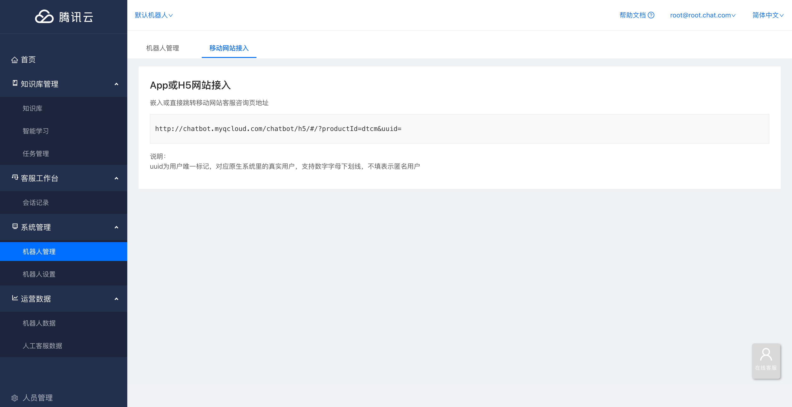
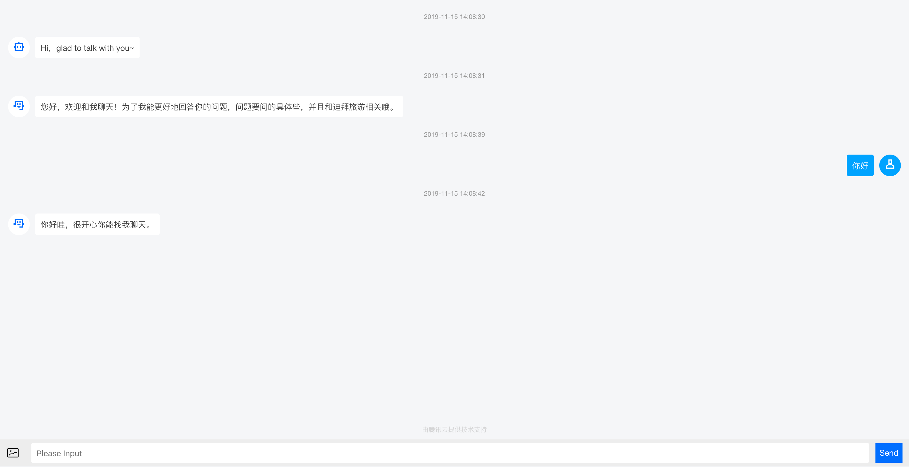

# App或H5接入

## 1. H5网站接入

如果您拥有自己设计的网页图标 / 样式 / 按钮， 您也可以将链接作为独立页面嵌入您的网页，让客户直接点击跳转成对话页面。

* **操作指引：系统管理 -&gt; 机器人配置 -&gt; 移动网站接入**



企业可以根据自己的需要将链接直接嵌入在网页的一些位置上。即可直接跳转到客服咨询页面

**\[ 移动网页接入样例 \]（点击智能客服后为对话页面）**



## 2. H5页面嵌入iOS App方案 <a id="h5&#x9875;&#x9762;&#x5D4C;&#x5165;ios-app&#x65B9;&#x6848;"></a>

### 2.1. 工程配置 <a id="&#x5DE5;&#x7A0B;&#x914D;&#x7F6E;"></a>

在Xcode工程中Info.plist文件中添加**支持HTTP**和**相机使用权限**

```text
    <key>NSCameraUsageDescription</key>
    <string>为了可以上传图片和视频</string>
    <key>NSAppTransportSecurity</key>
    <dict>
    <key>NSAllowsArbitraryLoads</key>
    <true/>
    </dict>
```

### 2.2. UI组件 <a id="ui&#x7EC4;&#x4EF6;"></a>

推荐使用 WKWebView\(iOS 8.0+\)，且使用编码的方式创建，参照代码：

```text
var webView: WKWebView!
    override func viewDidLoad() {
        super.viewDidLoad()
       // Do any additional setup after loading the view, typically from a nib.
       let url = "http://chatbot.myqcloud.com/chatbot/h5/#/?productId=dtcm&uuid="
       let request = URLRequest(url: URL(string: url)!)
       webView.load(request)
    }
override func loadView() {
    let webConfiguration = WKWebViewConfiguration()
    webView = WKWebView(frame: .zero, configuration: webConfiguration)
    view = webView
}
```

_如果为了兼容更低版本的操作系统，请使用 UIWebView_

### 2.3. 补充 <a id="&#x8865;&#x5145;"></a>

如果Xcode 控制台输出如下log：

```text
[discovery] errors encountered while discovering extensions: Error Domain=PlugInKit Code=13 "query cancelled" UserInfo={NSLocalizedDescription=query cancelled}
```

处理方式：

* 忽略，不会影响组件的使用\(推荐\)
* 修改工程设置
  1. 打开Xcode 菜单: Product &gt; Scheme &gt; Edit Scheme
  2. 在 Environment Variables 选项中添加`key-value： OS_ACTIVITY_MODE = disable`

## 3. H5页面嵌入Android App方案 <a id="h5&#x9875;&#x9762;&#x5D4C;&#x5165;android-app&#x65B9;&#x6848;"></a>

### 3.1. webview打开图库并获取android文件图片 <a id="webview&#x6253;&#x5F00;&#x56FE;&#x5E93;&#x5E76;&#x83B7;&#x53D6;android&#x6587;&#x4EF6;&#x56FE;&#x7247;"></a>

**【示例】**

1. 初始化webview

```text
private static final int FILE_SELECT_CODE = 0;
private ValueCallback<Uri> mUploadMessage;//回调图片选择，4.4以下
private ValueCallback<Uri[]> mUploadCallbackAboveL;//回调图片选择，5.0以上

    //允许JavaScript执行
    webView.getSettings().setJavaScriptEnabled(true);
    webView.getSettings().setLoadsImagesAutomatically(true);
    webView.setVerticalScrollBarEnabled(false);

    //运行webview通过URI获取安卓文件
    webView.getSettings().setAllowFileAccess(true);
    webView.getSettings().setAllowFileAccessFromFileURLs(true);
    webView.getSettings().setAllowUniversalAccessFromFileURLs(true);
    webView.setWebChromeClient(new MyWebChromeClient());//设置可以打开图片管理器
    webView.loadUrl("xxxxxxxx");
```

1. 继承WebChromeClient ，根据android不同版本不同处理

```text
private class MyWebChromeClient extends WebChromeClient {

    // For Android 3.0+
    public void openFileChooser(ValueCallback<Uri> uploadMsg) {
        mUploadMessage = uploadMsg;
        Intent i = new Intent(Intent.ACTION_GET_CONTENT);
        i.addCategory(Intent.CATEGORY_OPENABLE);
        i.setType("image/*");
    startActivityForResult(Intent.createChooser(i, "File Chooser"), FILE_SELECT_CODE);
    }

    // For Android 3.0+
    public void openFileChooser(ValueCallback uploadMsg, String acceptType) {
        mUploadMessage = uploadMsg;
        Intent i = new Intent(Intent.ACTION_GET_CONTENT);
        i.addCategory(Intent.CATEGORY_OPENABLE);
        i.setType("*/*");
        startActivityForResult(Intent.createChooser(i, "File Browser"), FILE_SELECT_CODE);
    }

    // For Android 4.1
    public void openFileChooser(ValueCallback<Uri> uploadMsg, String acceptType, String capture) {
        mUploadMessage = uploadMsg;
        Intent i = new Intent(Intent.ACTION_GET_CONTENT);
        i.addCategory(Intent.CATEGORY_OPENABLE);
        i.setType("image/*");
        startActivityForResult(Intent.createChooser(i, "File Chooser"), FILE_SELECT_CODE);
    }

    // For Android 5.0+
    public boolean onShowFileChooser(WebView webView, ValueCallback<Uri[]> filePathCallback, WebChromeClient.FileChooserParams fileChooserParams) {
        mUploadCallbackAboveL = filePathCallback;
        Intent i = new Intent(Intent.ACTION_GET_CONTENT);
        i.addCategory(Intent.CATEGORY_OPENABLE);
        i.setType("*/*");
        startActivityForResult(
            Intent.createChooser(i, "File Browser"),
            FILE_SELECT_CODE);
        return true;
    }
}
```

1. 在页面的onActivityResult回调里面处理传回来的图片uri

```text
@Override
public void onActivityResult(int requestCode, int resultCode, Intent data) {
    super.onActivityResult(requestCode, resultCode, data);
    if (resultCode != Activity.RESULT_OK) {
           return;
    }

    switch (requestCode) {
        case FILE_SELECT_CODE: {
            if (Build.VERSION.SDK_INT >= 21) {//5.0以上版本处理
                Uri uri = data.getData();
                Uri[] uris = new Uri[]{uri};

               /* ClipData clipData = data.getClipData();  //选择多张
                if (clipData != null) {
                    for (int i = 0; i < clipData.getItemCount(); i++) {
                        ClipData.Item item = clipData.getItemAt(i);
                        Uri uri = item.getUri();
                        uris[i]=uri;
                    }
                }*/
                mUploadCallbackAboveL.onReceiveValue(uris);//回调给js
            } else {//4.4以下处理
                Uri uri = data.getData();
                mUploadMessage.onReceiveValue(uri);
            }
        }
        break;
    }
}
```

### 3.2. 注意事项 <a id="&#x6CE8;&#x610F;&#x4E8B;&#x9879;"></a>

在Android5.0 以及以上的系统，当WebView加载的链接为Https开头，但是链接里面的内容，比如图片为Http链接，这时候，图片就会加载不出来，出现图裂。

解决：在webview加载页面之前，即初始化的时候，设置加载模式为混合模式（`MIXED_CONTENT_COMPATIBILITY_MODE = 2`） 如：

```text
if (Build.VERSION.SDK_INT >= Build.VERSION_CODES.LOLLIPOP) {
webView.getSettings().setMixedContentMode(WebSettings.MIXED_CONTENT_COMPATIBILITY_MODE);
｝
webView.getSettings().setBlockNetworkImage(false)；
```

