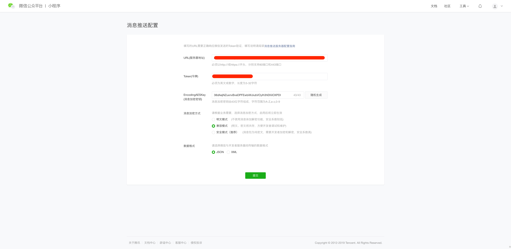

# 小程序接入

### 微信小程序接入

> 如果您已拥有一个通过微信认证的微信小程序，只需将您的微信小程序绑定到我们的Chatbot系统，就能够利用智能客服机器人轻松处理来自微信用户的咨询。

#### 接入方式一

* 在微信小程序中使用小程序自带的客服功能，需要做如下几步:

1. 请先登录微信小程序管理后台，并跳转到 开发设置-》开发者ID-》复制 AppID\(小程序ID\) 和 AppSecret\(小程序密钥\) 。


1. [点击](https://mp.weixin.qq.com/)：开发设置-》消息推送-》启用。 详见：[微信小程序开发文档](https://developers.weixin.qq.com/miniprogram/dev/component/web-view.html?search-key=web)。相关填写参数对照如下：

```text
**1 URL(服务器地址)**

稍后填写

**2 Token(令牌)**

请自行填写并复制

**3 EncodingAESKey(消息加密密钥)**

请自行填写或选择随机生成，并复制

**4 消息加密方式** 

选择 "兼容模式"

**5 数据格式 **

选择 "JSON"

```



以上数据填写完成后，将上面需要复制的信息填入如下代码中并复制，提供给我们的开发人员

```text
AppID:
AppSecret:
Token:
EncodingAESKey:
```

开发人员稍后会返回一串URL地址，并将其填写到  开发设置-》消息推送-》URL\(服务器地址\) 中，填写完毕后点击保存即可

2. 添加微信小程序客服按钮到已有的微信小程序中，并将我们提供的 `productId` 填入，示例代码如下:

```text
<button open-type="contact" session-from='{"productID":"723de070-ade3-11e9-a9b7-8d4c0de10ac5","nickName":"{{nickName}}", "avatarUrl":"{{avatarUrl}}"}'>进入客服会话</button>
```

3. 准备工作完成，可以开始使用客服系统

**接入方式二**

暂无

