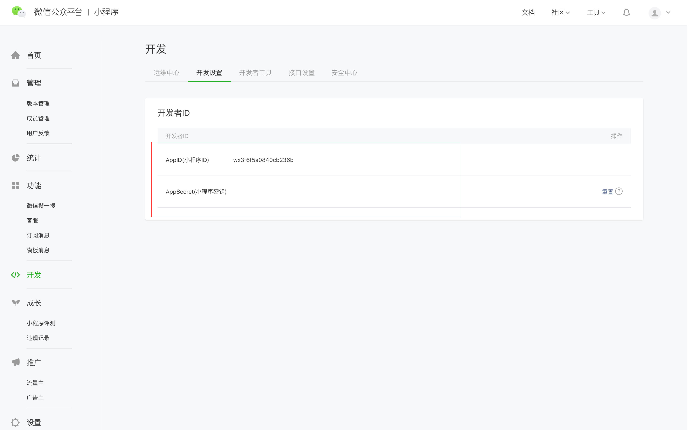

# Mini-program

### WeChat miniprogram

> If you already have a WeChat mini-program certified by WeChat, just bind your WeChat mini-program to our Chatbot system, and you can easily handle inquiries from WeChat users with intelligent customer service robots.

#### Access process

In order to use the customer service function of WeChat mini-program, you should take following steps:

1.Please log into WeChat mini-program management background first and go to Development settings --&gt; Developer ID --&gt; copy AppID \(mini-program ID\) and AppSecret \(mini-program Key\).



2. Click: Development Settings --&gt;Message Push --&gt; Start. For details, please refer to [WeChat mini-program Development Document](https://developers.weixin.qq.com/miniprogram/dev/component/web-view.html?search-key=web). See our reference sample below:

```text
**1 URL**

///

**2 Token**

please fill in or copy

**3 EncodingAESKey**

please fill in or choose randomly generate

**4 Message encryption** 

choose "Compatible Mode"

**5 Data format **

choose "JSON"

```


After finishing the above process, please fill in the following code and provide them to our developers.

```text
AppID:
AppSecret:
Token:
EncodingAESKey:
```

Our developers will return a series of URL address later on, please fill the URL in  Development Settings --&gt;Message Push --&gt; URL. Then click save.

3. Add the WeChat mini-program customer service button to the existing WeChat mini-program and fill in the productId we provided. The sample code is as follows:

```text
<button open-type="contact" session-from='{"productID":"723de070-ade3-11e9-a9b7-8d4c0de10ac5","nickName":"{{nickName}}", "avatarUrl":"{{avatarUrl}}"}'>进入客服会话</button>
```

4. The preparation work is done and you can start to use the customer service system.

\*\*\*\*

