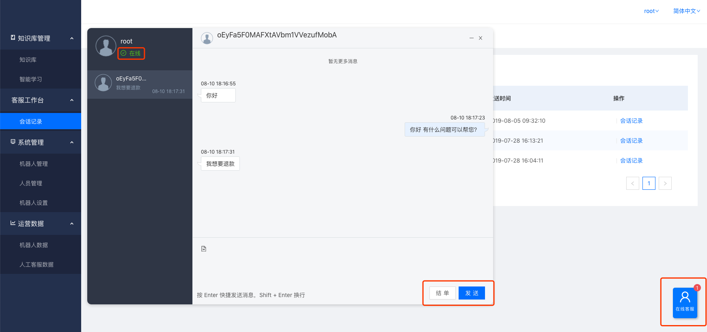

# 会话记录

## 在线客服

在线客服客服入口可供客服人员进行人工服务，当机器人回答不了的问题，或者用户主动发起的人工服务时，客服可以在这里解决用户问题。

客服人员对人工会话可进行「结单」操作，当解决完用户的问题后，可以点击「结单」主动结束会话。客服可以设置「在线」与「离线」操作，当点击「离线」时，不在进行派单。

## 会话记录

会话记录页面展示所有的会话历史记录，可以按照时间、用户昵称、会话渠道进行过滤筛选。

点击「会话记录」可以查看会话详情，会话详情根据会话时间段由远及近排序。

